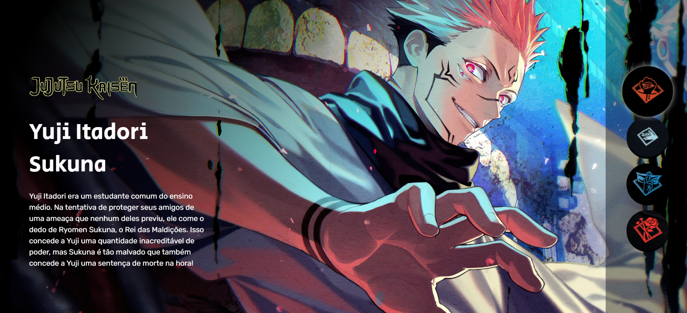

<h1 align="center">Seletor de personagens Jujutsu Kaisen</h1>

Esse projeto foi promovido pelo Dev em Dobro no evento "SEMANA DO ZERO AO PROGRAMADOR CONTRATADO" para ensino de conceitos básicos de desenvolvimento front-end.

## Índice

- [Visão geral](#visão-geral)
  - [Desafio](#desafio)
  - [Screenshot](#screenshot)
- [Meu progresso](#meu-progresso)
  - [Construído com](#construído-com)
  - [O que eu aprendi](#o-que-eu-aprendi)
  - [Desenvolvimento contínuo](#desenvolvimento-contínuo)
- [Desenvolvedor](#desenvolvedor)


## Visão geral

### Desafio

Os usuários devem ser capazes de:

- Ver o layout ideal para o site dependendo do tamanho da tela do dispositivo.
- Interatividade com o site.

### Screenshot




## Meu progresso

### Construído com:

- Semantic HTML5 markup
- CSS custom properties
- JavaScript

### O que eu aprendi

Com esse projeto pude desenvolver meu aprendizado com Position e as regras de suas propriedades.

```css
main::after{
    position: fixed;
}

.conteudo{
    position: absolute;
}

.botoes{
    position: fixed;
}
```

### Desenvolvimento contínuo

Com o JavaScript, pretendo utilizar mais do forEach em futuros projetos para que assim eu possa entende-lo melhor, aprender técnicas e estar mais confortável para útiliza-lo.

## Deploy

- [Seletor Jujutsu Kaisen](https://jujutsu-kaisen-seven.vercel.app/)

## Desenvolvedor

- LinkedIn - [Driely Santos](https://www.linkedin.com/in/driely-santos98/)
- DevEmDobro - [@devemdobro](https://www.instagram.com/devemdobro/)
